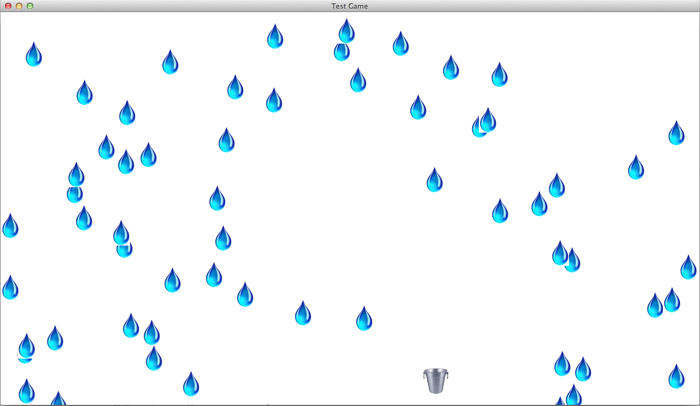

# libgdx-testgame

Going through one of the libGDX tutorials, this makes an absurdly simple game where you control a bucket and attempt to catch water droplets. A good intro to basic libGDX usage, though.

I can't find the link for the tutorial (it may have been for a far-outdated version of libGDX), so if you find it, I welcome a pull request to add it to this readme!
